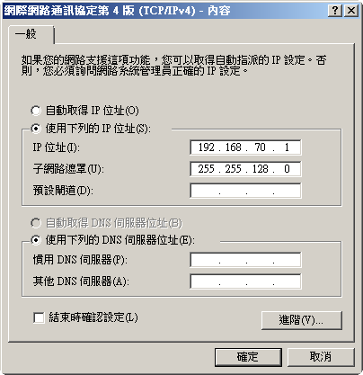
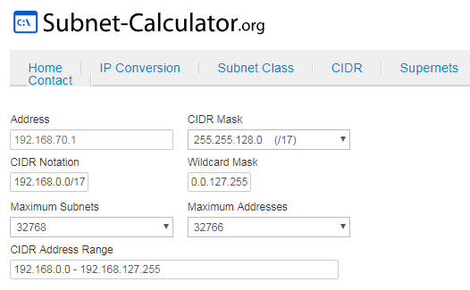
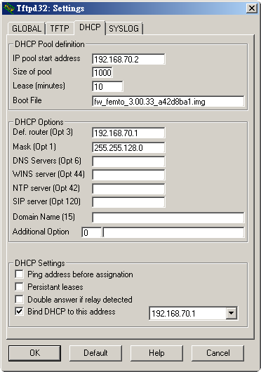
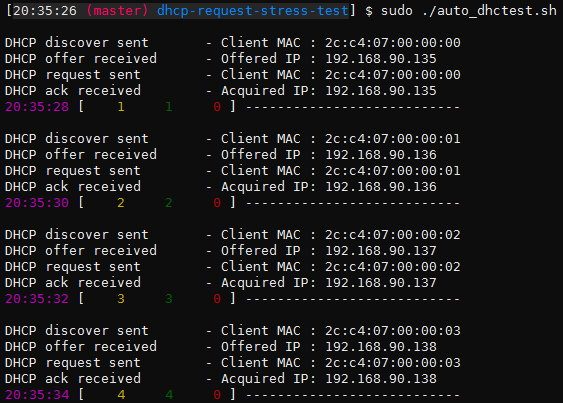
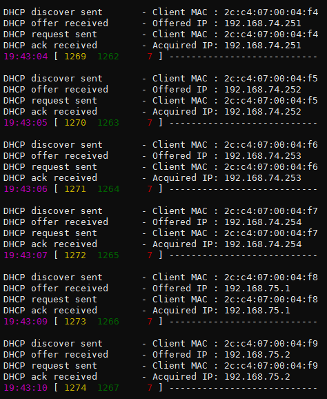
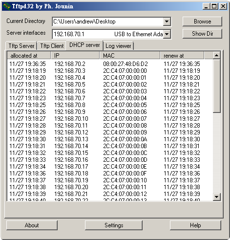

# dhcp-request-stress-test

stress test for tftpd32-DHCP IP request

## utilities

* [tftpd32.452](http://tftpd32.jounin.net/download/tftpd32.452.zip)
* [dhtest](https://github.com/saravana815/dhtest) github

## dhtest command

	$ ./dhtest --help
	Usage: ./dhtest [ options ]
	  -m mac_address
	  -N					# always use interface's MAC address in Ethernet frame
	  -r, --release				# Releases obtained DHCP IP for corresponding MAC
	  -L, --option51-lease_time [ Lease_time ] # Option 51. Requested lease time in secondes
	  -I, --option50-ip	[ IP_address ]	# Option 50 IP address on DHCP discover
	  -o, --option60-vci	[ VCI_string ]	# Vendor Class Idendifier string
	  -h, --option12-hostname [ hostname_string ] # Client hostname string
	  -c, --custom-dhcp-option [ option_format ] # option_format - option_number,type_of_option_value(str|num|hex|ip),option_value
	  -v, --vlan		[ vlan_id ]	# VLAN ID. Range(1 - 4094)
	  -t, --tos		[ TOS_value ]	# IP header TOS value
	  -i, --interface	[ interface ]	# Interface to use. Default eth0
	  -T, --timeout		[ cmd_timeout ]	# Command returns within specified timout in seconds
	  -b, --bind-ip				# Listens on the obtained IP. Supported protocols - ARP and ICMP
	  -k, --bind-timeout	[ timeout ]	# Listen timout in seconds. Default 3600 seconds
	  -f, --bcast_flag			# Sets broadcast flag on DHCP discover and request
	  -d, --fqdn-domain-name   [ fqdn ]	# FQDN domain name to use
	  -n, --fqdn-server-not-update		# Sets FQDN server not update flag
	  -s, --fqdn-server-update-a		# Sets FQDN server update flag
	  -p, --padding				# Add padding to packet to be at least 300 bytes
	  -P, --port		[ port ]	# Use port instead of 67
	  -g, --giaddr		[ giaddr ]	# Use giaddr instead of 0.0.0.0
	  -u, --unicast		[ ip ]		# Unicast request, IP is optional. If not specified, the interface address will be used. 
	  -a, --nagios				# Nagios output format. 
	  -S, --server		[ address ]	# Use server address instead of 255.255.255.255
	  -j, --json				# Set the output format to json
	  -D, --decline				# Declines obtained DHCP IP for corresponding MAC
	  -V, --verbose				# Prints DHCP offer and ack details
	  dhtest version 1.5

Ex:

	./dhtest -i eth1 -T 10 -m 2c:c4:07:00:06:a0
	DHCP discover sent	 - Client MAC : 2c:c4:07:00:06:a0
	DHCP offer received	 - Offered IP : 192.168.76.170
	DHCP request sent	 - Client MAC : 2c:c4:07:00:06:a0
	DHCP ack received	 - Acquired IP: 192.168.76.170

## test environment

running VM on host PC 

	                 host PC
	+-----------------------------------------+
	|* eth: 192.168.70.1/255.255.128.0        |
	|* tftpd32-dhcp                           |
	+-----------------------------------------+
	|* VM(eth1): 192.168.70.2/255.255.255.128 |
	|* dhtest                                 |
	+-----------------------------------------+

VM: [Ubuntu 14.04.5 LTS i386](https://cloud-images.ubuntu.com/vagrant/trusty/current/trusty-server-cloudimg-i386-vagrant-disk1.box)

VM routing table

	$ route -n
	Kernel IP routing table
	Destination     Gateway         Genmask         Flags Metric Ref    Use Iface
	0.0.0.0         192.168.70.1    0.0.0.0         UG    0      0        0 eth1
	10.0.2.0        0.0.0.0         255.255.255.0   U     0      0        0 eth0
	192.168.0.0     0.0.0.0         255.255.128.0   U     0      0        0 eth1 

### host PC

### tftpd32-dhcp

## RUN test!

	$ sudo ./auto_dhctest.sh

console output

Ex in different dhcp-env

~ END ~